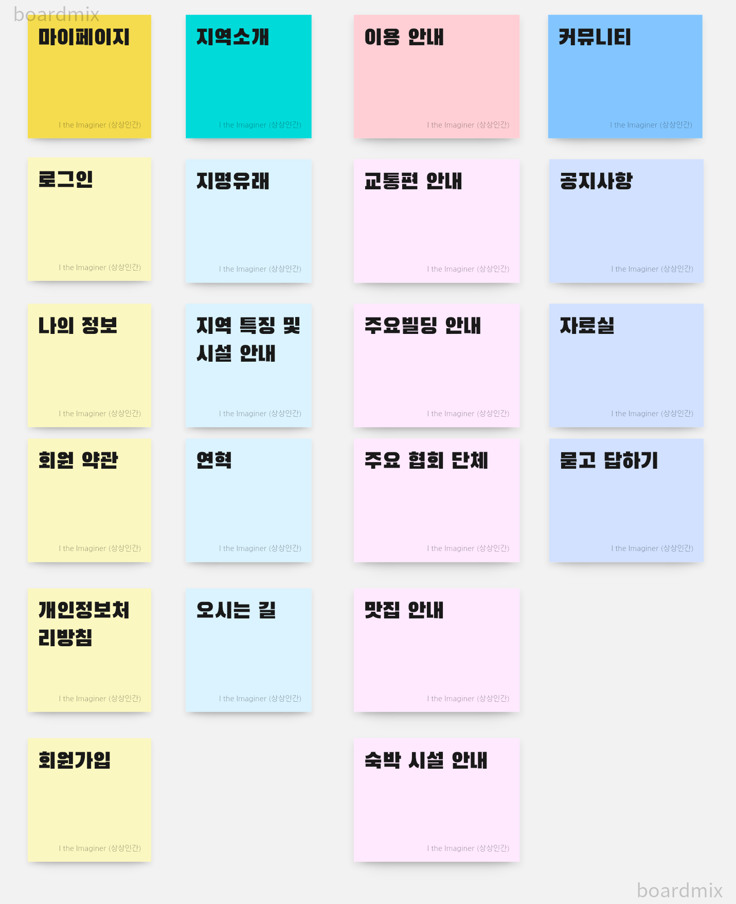

# 프로젝트 개발 보고서(project development report)
--------------------------------
## 1. 프로젝트 개요(Project Outline)
서울 도봉구에 있는 방학동을 홍보하기 위해 제작. 자바 웹 개발 애플리케이션을 사용하여 만들어졌다.

  

## 2. 프로젝트 목적
방학동의 요소, 문화, 맛집, 

## 3. 프로젝트 개발 환경 정보(Project Development Information)
- Project Topic: Welcome to Dogbong-gu Banghak-dong
- Development Environment Open JDK-11
- Language: Java 11
- Web Module:JSP/Servlet 3.0
- Process Pattern: MVC Pattern
- Database System: Oracle 21C XE
- Database Design: SQL DEveloper 23.1.1
- Entity Relationship Design: draw.io 20.08.16
- Java Database Connector : ojdbc11
- Application Design: Object aid 1.2.4
- Back Template Language: Javva/Sevlet 11
- Front Template Lnaguage: JSP(JSTL/EL) 3.0/HTML5/CSS3/JavaScript ES5
- Web Server: Tom9.0
- Package Information 

  

## 4. 프로젝트 기획 및 설계(Project Planning& Design)

### 4-1. 네비게이션 설계(Navigation Design)
| 마이페이지 | 지역소개 | 이용안내 | 커뮤니티 |
| 로그인 | 지명 유래 | 교통편 안내 | 공지사항 |
#### 4-1-1. 자료수집 - word cloud

#### 4-1-2.  콘텐츠 분류 - card sorting

#### 4-1-3. 서비스 흐름 설계 - usecase

#### 4-1-4. 관리자 시나리오 - admin scenario

1. 지역 소개인 지명 유래와 연혁을 탐색한다
2. 지역 소개인 지여특징ㅁ 및 시설 안내를 탐색한다
3. 해당 지역의 지도가 궁금하여 오시는 길을 탐색한다
4. 해당 지역의 교통편을 알아보고, 방문을 계획한다
5. 사용자는 어디어디에 방문할지 주요 빌딩과 주요 협회, 맛집 등을 확인한다
6. 해당 지역의 이벤트나 특이사항을 확인하기 위하여 공지사하의 글을 확인한다
7. 공지사항의 글을 확인하거나 질문을 위하여 회원가입을 시작한다
8. 회원가입을 시작하게 되면 회원 약관 및 개인정보철리 방침에 동의하도록 한다
9.  회원가입 페이지에서 필수 정보를 입력하고, 아이디의 중복확인 거쳐 회원가입을 완료하도록 한다
10. 회원가입 후 로그인을 하도록 한다
11. 공지사항ㅇ 글을 확인하고 해당정보가 없는 경우 궁금한 사항을 질문하기 위해 묻고 답하기로 이동한다
12. 묻고 답하기 페이지에서 궁금한 사항에 대한 답이 있는지 검색한다
13. 해당 정보가 있으면 해당 묻고 답하기 글을 확인하고 없으면 질문을 등록하도록한다
14. 카탈로그나 가이드가 있는지 확인하기 위해 자료실을 탐색한다.
15. 해당 자료가 있음을 확인하고, 자료를 다운로드한다

**관리자 시나리오**
1. 관리자로 로그인을 하도록 한다
2. 공지사항 목록을 확인하고 누락된 정보가 있는지 확인한다
3. 해당 지역의 이벤트나 특이사항을 공지사항으로 등록하도록 한다
4. 변동된 내용이 있을 경우 공지사항을 수정하도록한다
5. 이벤트 특이사항 중에서 취소된 내용이 있어 공지사항 글을 삭제하도록 한다.
6. 묻고 답하기 목록으로 이동하여 등록된 질문을 확인하여 답변 글을 등록한다
7. 만약 스팸 글인 경우 불필요한 질문인 경우 해당글을 삭제하도록 한다
8. 카타로그나 가이드가 새롭게 발생한 경우 자료실에 해당 글을 쓰고, 자료를 등록하도록 한다
9. 지역 소개에 대한 변동이 있어 해당 페이지의 내용을 수정한다
10. 이용아내에 대한 변동사항이 있어 새로운 내용으로 변경한다
11. 회원 목록으로 이동하여 신규회원이나 탈퇴 회원을 확인하도록 하고,
현재 제적 사유에 해당하는 회원은 강퇴시키도록 한다

### 4-2. 데이터베이스 설계

#### 4-2-1. 

#### 4-2-2. 논리적 설계

#### 4-2-3. 물리적 설계

